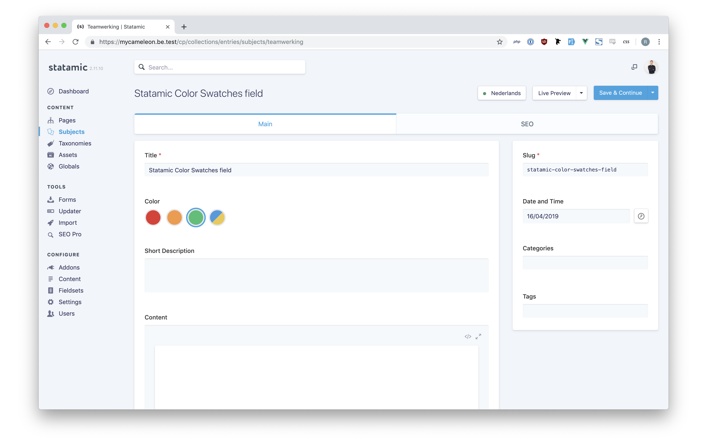

[](https://github.com/riasvdv/statamic-color-swatches/releases)

# Color Swatches

> Color Swatches for Statamic 3.

For the Statamic 2 version, check out the [v1 branch](https://github.com/riasvdv/statamic-color-swatches/tree/v1)

Let clients choose from a predefined set of colors.



## License

Color Swatches requires a license to be used while on a production site.  
You can purchase one at https://statamic.com/marketplace/addons/color-swatches.

You may use Color Swatches without a license while Statamic is in [Trial mode](https://docs.statamic.com/knowledge-base/trial-mode).

## Installation

Clone the Github repo somewhere, then add it to your `composer.json`'s `repositories` array. (This is only necessary until the package is released.) Adjust the `url` to point to cloned directory.

``` json
"repositories": [
    {
        "type": "path",
        "url": "addons/rias/color-swatches"
    }
]
```

Require it using Composer.

```
composer require rias/statamic-color-swatches
```

Publish the assets:

```
php artisan vendor:publish --provider="Rias\ColorSwatches\ServiceProvider"
```

## Color Swatches Overview

Instead of providing a user a full color picker, Color Swatches gives an admin the ability to provide a selection of colors for a user to choose from.

## Using Color Swatches

Add the fieldtype to your fieldset, you can define multiple colors for a swatch by using a YAML array. You can also set a default color by entering the label.

```yaml
sections:
  main:
    display: Main
    fields:
      -
        handle: color
        field:
          type: color_swatches
          display: Color
          colors:
            -
              label: red
              value:
                - '#F56565'
            -
              label: orange
              value:
                - '#ED8936'
            -
              label: green
              value:
                - '#48BB78'
            -
              label: blue_yellow
              value:
                - '#4299E1'
                - '#E7C961'
```

## Using Color Swatches

You can access both the label and color in your template.

```twig
{{ color.label }}
{{ color.value }}
{{ color.value.0 }} #If it's more than one color
```

Brought to you by [Rias](https://rias.be)
